# AttriSense

AttriSense is a production-readable workforce intelligence demo that turns HR data into retention-risk decisions. It generates synthetic employee data, trains a retention-risk model, stores predictions in SQLite, exposes an executive Streamlit dashboard, and supports natural-language SQL for non-technical users.

Repository: https://github.com/Dogiparthi-Sharada/AttriSense

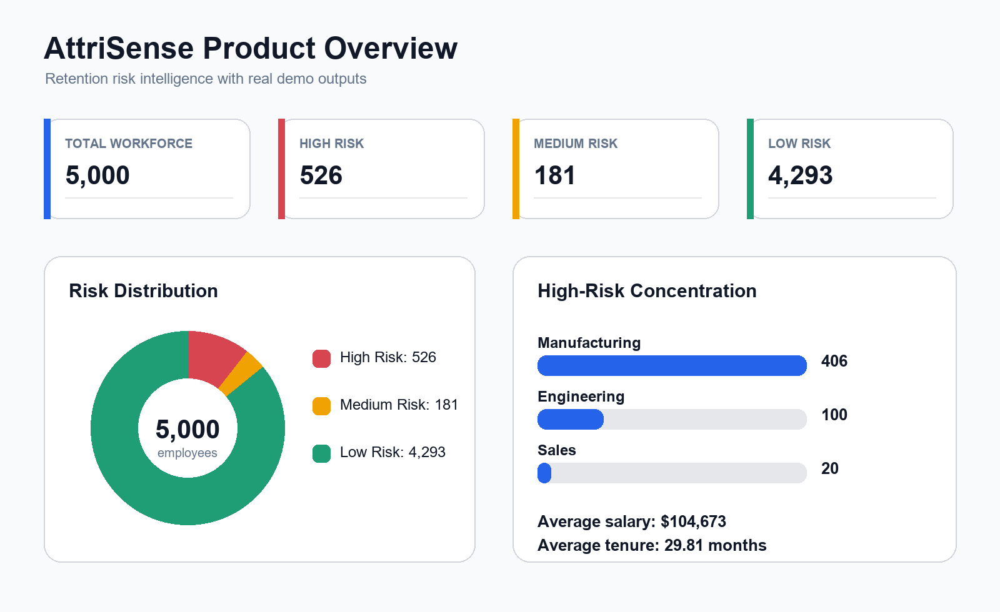

## What This Project Proves

Attrition is expensive because leaders often discover risk after it becomes resignation volume. AttriSense shows how a compact AI system can answer:

- Which employees are most likely to leave?
- Which departments carry the highest risk concentration?
- What should HR prioritize first?
- How can a business user ask the data questions without writing SQL?

The current dataset is synthetic, so the project is safe to run, demo, publish, and extend without exposing employee information.

## Product Capabilities

| Capability | Production purpose |
| --- | --- |
| Executive dashboard | Gives leaders a fast read on total workforce, risk bands, department concentration, and intervention priorities. |
| Retention-risk model | Uses Random Forest plus SMOTE to learn rare turnover patterns and score each employee. |
| SHAP explainability | Explains high-risk employee scores with primary risk drivers and global feature impact. |
| Natural-language SQL | Converts plain-English HR questions into guarded, read-only SQLite queries. |
| Exit-interview vector index | Builds a FAISS index for semantic analysis of synthetic exit interview notes. |
| Public Streamlit launcher | Runs the app on `0.0.0.0` so it can be exposed from a VM, server, tunnel, or deployment platform. |

## Dashboard Screenshots

These screenshots were captured from the restored Streamlit dashboard running at `http://127.0.0.1:8501/`. The capture log lives in [outputs/dashboardCaptureLog.txt](outputs/dashboardCaptureLog.txt), and the machine-readable manifest lives in [outputs/dashboardScreenshotManifest.json](outputs/dashboardScreenshotManifest.json).
The full README asset inventory lives in [outputs/readmeAssetInventory.txt](outputs/readmeAssetInventory.txt).

| Asset | What it shows |
| --- | --- |
| `assets/executiveDashboard.png` | Executive KPIs, key insights, flight-risk distribution, high-risk department hot spots, and department risk profile. |
| `assets/turnoverAnalytics.png` | Detailed high-risk employee analytics with intervention KPIs, risk probability distribution, recommended actions, and employee details. |
| `assets/tenureAnalytics.png` | Tenure versus flight-risk analytics with average tenure, median tenure, and early-tenure employee KPIs. |
| `assets/salaryAnalytics.png` | Compensation distribution by department and risk level with average salary, median salary, and salary range KPIs. |
| `assets/departmentComparison.png` | Department-level comparison table for employee count, average risk, salary, and tenure. |
| `assets/aiAssistant.png` | Natural-language AI assistant with example workforce questions and SQL execution workflow. |
| `assets/shapInsightsDashboard.png` | SHAP explainability center with global drivers, board-level insights, and employee-level risk explanations. |

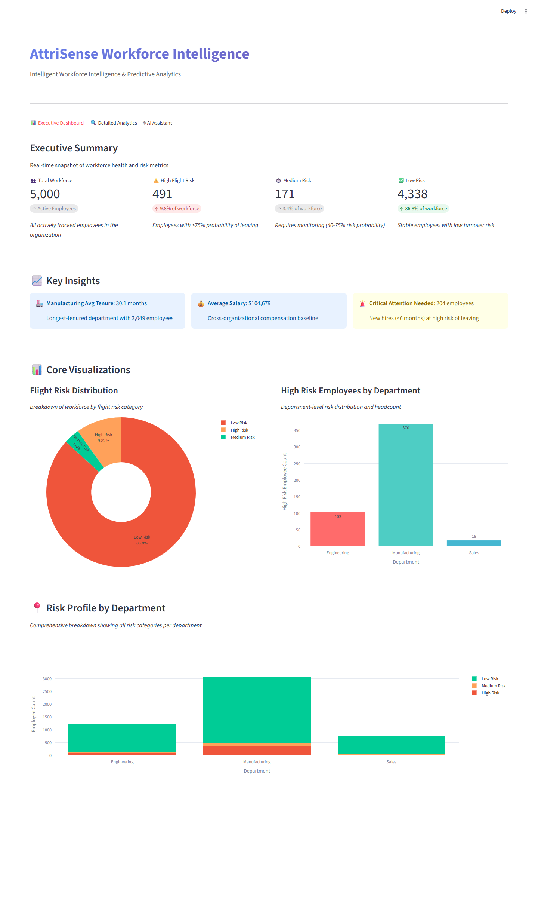

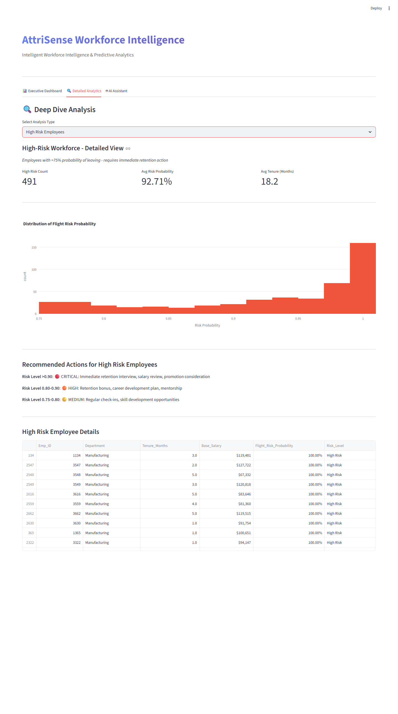

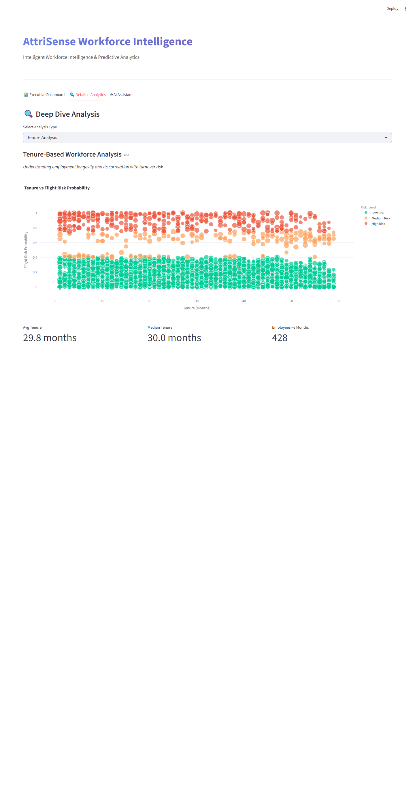

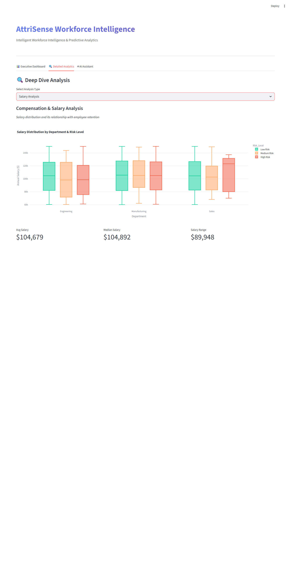

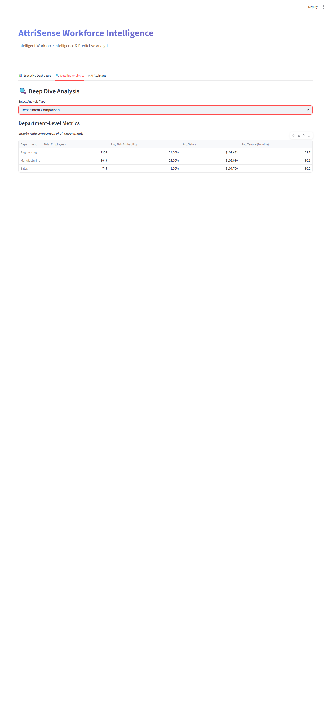

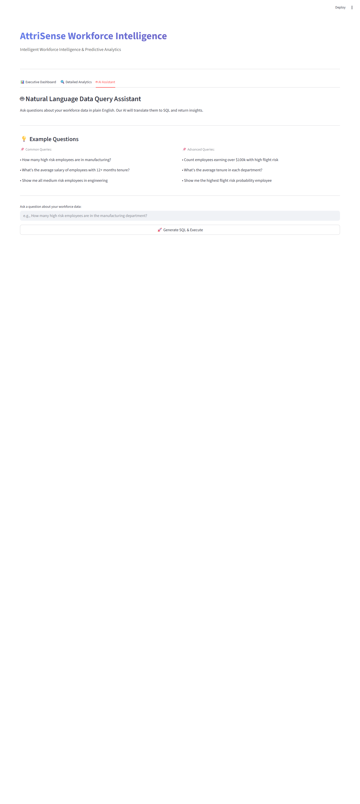

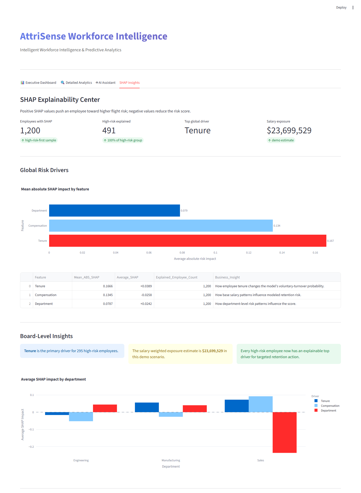

## Visual Outputs

The images below are generated from the real SQLite output by `create_readme_assets.py`. The architecture image is copied from [doc/architecture_diagram.png](doc/architecture_diagram.png) into `assets/architecture.png` so the README uses the preferred diagram.

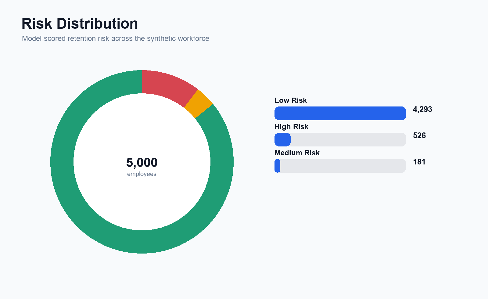

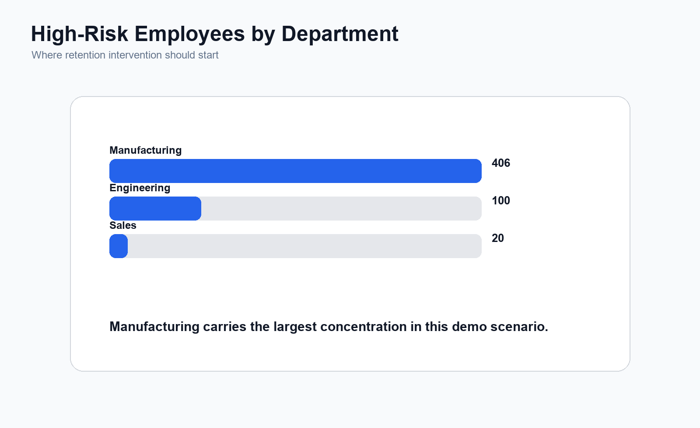

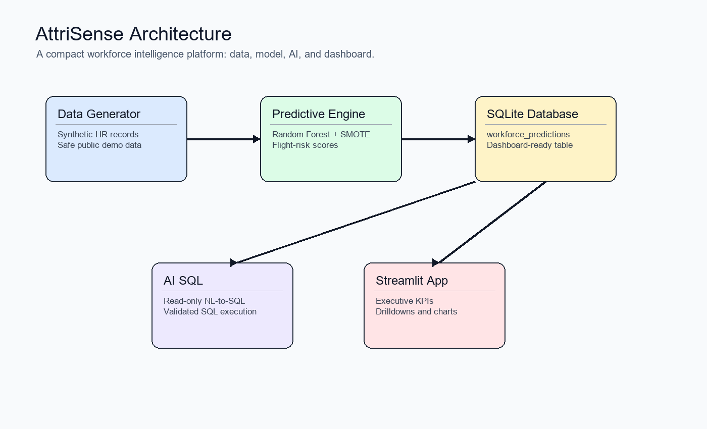

## Real Run Evidence

Pipeline output captured in [outputs/pipeline_run.txt](outputs/pipeline_run.txt):

```text
AttriSense Pipeline Run
======================

$ python.exe generate_demo_workforce_data.py
Generated 5,000 synthetic employees at attrisense_synthetic_hr.csv.
exit_code=0

$ python.exe train_retention_risk_model.py
Loading workforce data...
Saved 5,000 employee risk scores to hr_enterprise.db:workforce_predictions.
Saved SHAP feature impact to hr_enterprise.db:shap_feature_impact and outputs/shapInsights.txt.
exit_code=0

Skipped optional build_exit_interview_vector_index.py in this capture because it requires OPENAI_API_KEY.
```

Metrics captured in [outputs/metrics_snapshot.txt](outputs/metrics_snapshot.txt):

```text
Total workforce: 5,000
Average salary: $104,679
Average tenure: 29.82 months

Risk distribution:
- High Risk: 491
- Medium Risk: 171
- Low Risk: 4,338

High-risk employees by department:
- Manufacturing: 370
- Engineering: 103
- Sales: 18
```

## Sample Data Outputs

| Metric | Output |
| --- | ---: |
| Total workforce | 5,000 |
| High flight risk | 491 |
| Medium risk | 171 |
| Low risk | 4,338 |
| Average salary | $104,679 |
| Average tenure | 29.82 months |

| Department | High-risk employees |
| --- | ---: |
| Manufacturing | 370 |
| Engineering | 103 |
| Sales | 18 |

| Emp_ID | Department | Tenure | Salary | Risk probability | Risk level |
| ---: | --- | ---: | ---: | ---: | --- |
| 1009 | Manufacturing | 3 months | $107,927 | 1.000 | High Risk |
| 1050 | Manufacturing | 20 months | $71,247 | 1.000 | High Risk |
| 1134 | Manufacturing | 3 months | $119,481 | 1.000 | High Risk |

## AI Assistant Example

Question:

```text
How many high risk employees are in Manufacturing?
```

Typical generated SQL:

```sql
SELECT COUNT(*) AS high_risk_manufacturing
FROM workforce_predictions
WHERE Department = 'Manufacturing'
  AND Risk_Level = 'High Risk';
```

Result:

```text
370
```

## SHAP Explainability

AttriSense now includes a dedicated `SHAP Insights` dashboard tab. The model explains all high-risk employees first, then adds a risk-weighted representative sample so the global driver story stays fast to regenerate locally.

The SHAP output is written into SQLite and summarized in [outputs/shapInsights.txt](outputs/shapInsights.txt):

```text
Global model drivers by mean absolute SHAP value:
- Tenure: 0.1666
- Compensation: 0.1345
- Department: 0.0787

Primary drivers among high-risk employees:
- Tenure: 295 employees
- Compensation: 139 employees
- Department: 57 employees
```

This is the enterprise-grade layer: leaders can see which workforce levers are driving risk, HR can explain individual high-risk scores, and Finance gets a salary-weighted exposure estimate instead of only a model probability.

## Architecture

```text
generate_demo_workforce_data.py
        |
        v
attrisense_synthetic_hr.csv
        |
        v
train_retention_risk_model.py
        |
        v
hr_enterprise.db:workforce_predictions
        |
        +--> streamlit_app.py
        +--> natural_language_sql.py
        +--> build_exit_interview_vector_index.py
```

The project stays intentionally small: one shared config file, clear pipeline stages, generated proof assets, and a Streamlit app that reads from SQLite.

## Quick Start

```bash
git clone https://github.com/Dogiparthi-Sharada/AttriSense.git
cd AttriSense

python -m venv attrisense_env
attrisense_env\Scripts\activate

pip install -r requirements.txt
python launch_streamlit_app.py
```

Open:

```text
http://localhost:8501
```

By default, `launch_streamlit_app.py` binds Streamlit to `0.0.0.0:8501`.

## Rebuild the Demo Pipeline

```bash
python generate_demo_workforce_data.py
python train_retention_risk_model.py
python create_readme_assets.py
python launch_streamlit_app.py
```

Optional vector index:

```bash
python build_exit_interview_vector_index.py
```

`build_exit_interview_vector_index.py` requires `OPENAI_API_KEY`. The dashboard and model do not.

## Optional AI Setup

The dashboard charts work without an OpenAI key. The AI Assistant and vector index builder require credentials.

```bash
copy .env.example .env
```

Set:

```text
OPENAI_API_KEY=your_openai_api_key_here
```

## Project Structure

```text
AttriSense/
|-- config.py                              # Shared paths, table name, risk thresholds
|-- generate_demo_workforce_data.py         # Creates synthetic HR demo data
|-- train_retention_risk_model.py           # Trains model and writes SQLite predictions
|-- build_exit_interview_vector_index.py    # Optional FAISS index builder
|-- natural_language_sql.py                 # Guarded natural-language to SQL helper
|-- streamlit_app.py                        # Streamlit dashboard
|-- launch_streamlit_app.py                 # Public Streamlit launcher
|-- create_readme_assets.py                 # Generates README PNGs and output captures
|-- assets/                                 # README-ready generated PNGs
|-- outputs/                                # Captured command and metric outputs
|-- attrisense_synthetic_hr.csv             # Demo dataset
|-- hr_enterprise.db                        # Demo prediction database
|-- faiss_hr_index/                         # Demo vector index
|-- .streamlit/config.toml                  # Streamlit runtime config
|-- .env.example                            # Environment variable template
`-- requirements.txt                        # Python dependencies
```

## How to Read the Code

Start here if you are new to the repo:

1. `config.py` defines shared filenames, table names, and risk thresholds.
2. `generate_demo_workforce_data.py` creates safe synthetic employee data.
3. `train_retention_risk_model.py` trains the model and writes predictions into SQLite.
4. `streamlit_app.py` loads SQLite data and renders the product dashboard.
5. `natural_language_sql.py` powers the optional AI Assistant with read-only SQL guardrails.
6. `create_readme_assets.py` regenerates the README images and output proof.
7. `launch_streamlit_app.py` is the single command-line app launcher.

Every root Python function has a docstring, and complex logic includes beginner-friendly inline comments.

## Production Notes

- `.env` is ignored and should never be committed.
- The included records are synthetic and safe for demos.
- The AI SQL path validates generated SQL and only runs read-only queries.
- SQLite is used for local simplicity; the same table contract can move to Postgres, Snowflake, or BigQuery.
- Generated README assets live in `assets/`; run logs and metrics live in `outputs/`.
- The model is intentionally interpretable and easy to replace with richer HR features.

## Roadmap

- Add model evaluation reports and CI quality gates.
- Add prescriptive retention playbooks connected to SHAP primary drivers.
- Add salary-weighted exposure forecasting by department and manager group.
- Add role-based access for HR partners and executives.
- Add deployment manifests for Streamlit Community Cloud and container platforms.
- Add automated dashboard screenshot refresh for README assets.

## License and Data

This repository is a portfolio/demo system. All included employee records are synthetic and should be replaced with governed HR data connectors before real-world deployment.
