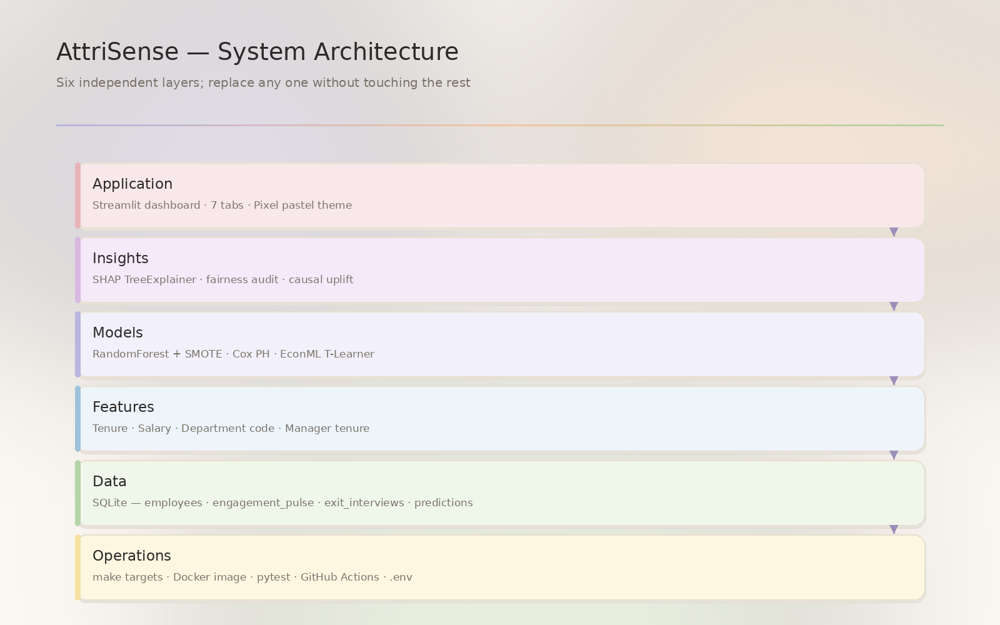
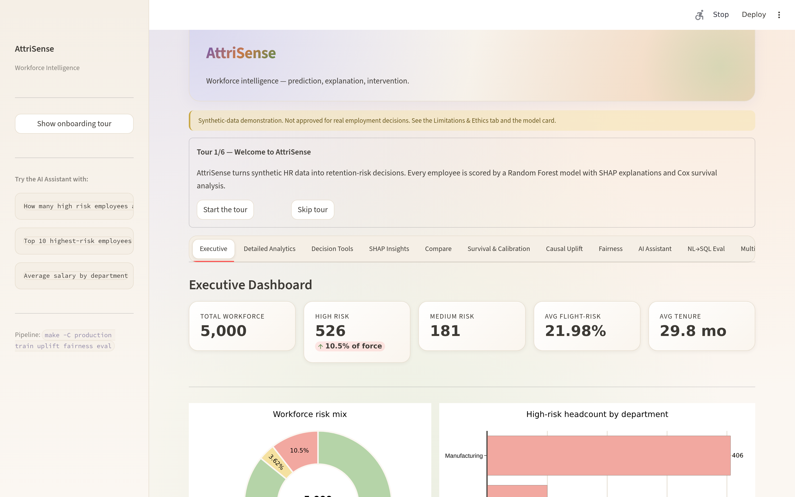
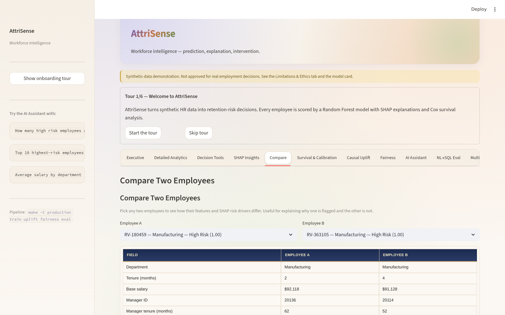
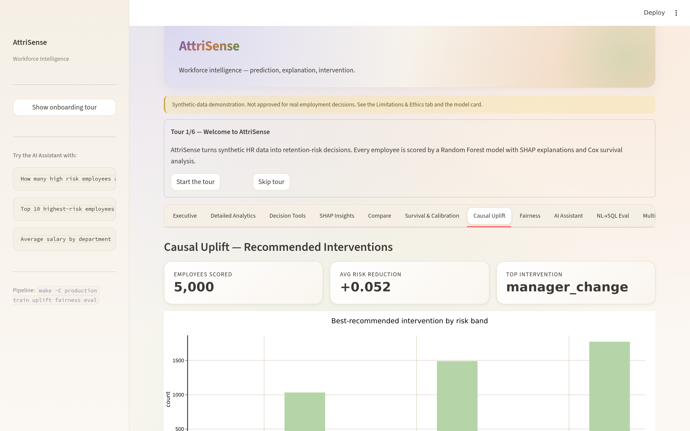
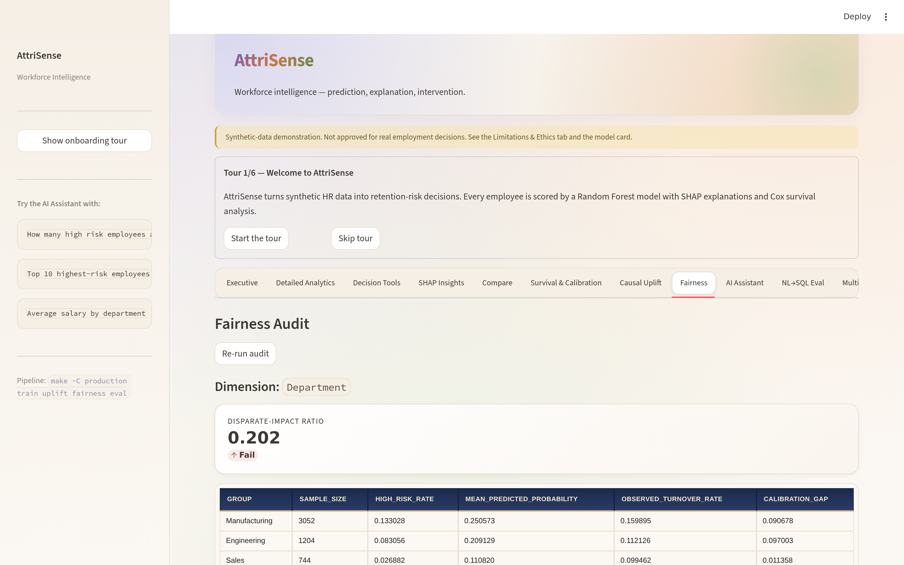
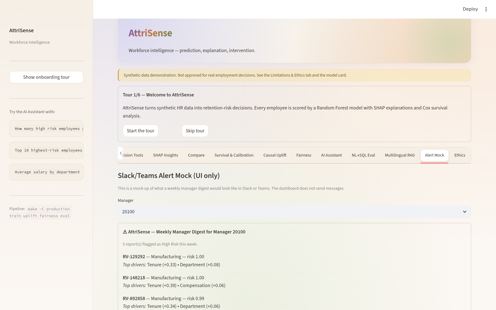
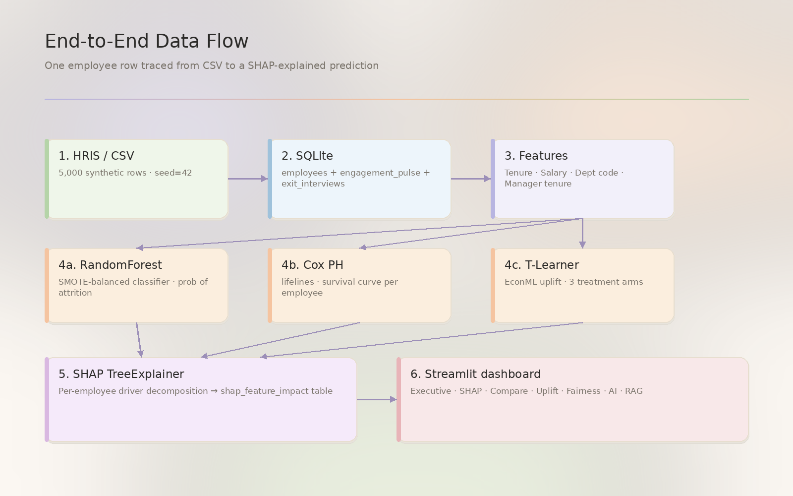

<div align="center">

# AttriSense

### Explainable, Fair, and Resilient Workforce Retention Analytics

*A production-grade Streamlit + scikit-learn + SHAP + LangChain dashboard for HR leaders who need to act on retention risk **without** acting on a black box.*

[](https://www.python.org/)
[](https://streamlit.io/)
[](production/tests/)
[](LICENSE)
[](docs/index.md)
[](docs/ethics/fairness-policy.md)



</div>

---

## Table of contents

- [Why AttriSense](#why-attrisense)
- [Feature tour](#feature-tour)
- [Quickstart (5 minutes)](#quickstart-5-minutes)
  - [Windows / PowerShell](#windows--powershell)
  - [macOS / Linux](#macos--linux)
  - [Docker](#docker)
- [What's in the box](#whats-in-the-box)
- [Architecture at a glance](#architecture-at-a-glance)
- [Documentation](#documentation)
- [Ethics statement](#ethics-statement)
- [Project layout](#project-layout)
- [Contributing](#contributing)
- [License](#license)

---

## Why AttriSense

Most retention dashboards stop at *"who's leaving?"*. AttriSense answers four harder questions:

| Question | How AttriSense answers it |
|---|---|
| **Why** is this person at risk? | SHAP per-employee waterfall + driver table |
| **What if** we change something? | What-if sliders + EconML T-learner uplift |
| **Is the model fair?** | EEOC four-fifths audit on every dashboard load |
| **What if the LLM is down?** | TF-IDF + hashing fallbacks for AI features |

Designed for **explainability first**, **fairness as a gate**, and **graceful degradation** when external services fail.

---

## Feature tour

<table>
<tr>
<td width="50%">

### Executive Dashboard
KPIs, risk distribution, manager rollups.



</td>
<td width="50%">

### SHAP Insights
Per-employee waterfall with driver explanations.


</td>
</tr>
<tr>
<td>

### Compare Employees
Side-by-side panel for two employees.



</td>
<td>

### Causal Uplift
EconML T-learner over three treatment arms.



</td>
</tr>
<tr>
<td>

### Fairness Audit
Disparate-impact ratio with pause-on-failure.



</td>
<td>

### AI Assistant
NL→SQL with TF-IDF gold-question fallback.


</td>
</tr>
<tr>
<td>

### Multilingual RAG
EN / ES / HI exit-interview semantic search.


</td>
<td>

### Alert Mock + Ethics
Slack/Teams card preview + model-card disclosure.



</td>
</tr>
</table>

Full feature breakdowns: [docs/features/](docs/features/).

---

## Quickstart (5 minutes)

### Windows / PowerShell

```powershell
# 1. Clone
git clone https://github.com/Dogiparthi-Sharada/AttriSense.git
cd AttriSense

# 2. Virtual environment (Python 3.11+)
py -3.11 -m venv .venv
.\.venv\Scripts\Activate.ps1
# If blocked: Set-ExecutionPolicy -Scope CurrentUser -ExecutionPolicy RemoteSigned

# 3. Install
pip install -r requirements.txt

# 4. Generate data + train model
python generate_demo_workforce_data.py
python train_retention_risk_model.py

# 5. Run the production dashboard
streamlit run production\streamlit_app.py
```

> **No `make` on Windows?** Use the direct `streamlit` / `pytest` commands shown above, run inside **Git Bash**, or `choco install make`.

### macOS / Linux

```bash
git clone https://github.com/Dogiparthi-Sharada/AttriSense.git
cd AttriSense

python3.11 -m venv .venv
source .venv/bin/activate              # bash/zsh
# OR: source .venv/bin/activate.csh    # csh/tcsh

pip install -r requirements.txt

python generate_demo_workforce_data.py
python train_retention_risk_model.py

# Production dashboard
make -C production run
# OR original demo:
python launch_streamlit_app.py
```

### Docker

```bash
cd production
docker build -t attrisense:latest -f Dockerfile ..
docker run --rm -p 8501:8501 --env-file ../.env attrisense:latest
```

Browse to <http://localhost:8501>.

> **Optional:** copy `.env.example` to `.env` and add `OPENAI_API_KEY=sk-...` to enable the AI Assistant + multilingual OpenAI embeddings. **Without a key, the dashboard still works** — it falls back to TF-IDF and hashing embeddings.

Full installation guide with all four shells (PowerShell, cmd, bash, csh): [docs/quickstart.md](docs/quickstart.md).

---

## What's in the box

| Capability | Tech | Code |
|---|---|---|
| Retention classifier | RandomForest + SMOTE | [`train_retention_risk_model.py`](train_retention_risk_model.py) |
| Survival analysis | Cox proportional hazards (`lifelines`) | same |
| Per-employee explanations | SHAP TreeExplainer | same |
| Causal uplift | EconML T-learner (3 treatment arms) | [`production/src/attrisense/causal_uplift.py`](production/src/attrisense/causal_uplift.py) |
| Fairness audit | EEOC four-fifths rule | [`production/src/attrisense/fairness.py`](production/src/attrisense/fairness.py) |
| NL→SQL Q&A | LangChain + OpenAI + SQLite, with TF-IDF fallback | [`natural_language_sql.py`](natural_language_sql.py) + [`production/src/attrisense/nl_sql_fallback.py`](production/src/attrisense/nl_sql_fallback.py) |
| NL→SQL eval | 50 gold questions across 4 categories | [`production/src/attrisense/nl_sql_eval.py`](production/src/attrisense/nl_sql_eval.py) |
| Multilingual RAG | LangChain + FAISS, OpenAI → hashing fallback | [`production/src/attrisense/multilingual_rag.py`](production/src/attrisense/multilingual_rag.py) |
| Onboarding tour | session-state cursor over 6 steps | [`production/src/attrisense/onboarding.py`](production/src/attrisense/onboarding.py) |
| Slack/Teams mock | preview-only card renderer | [`production/src/attrisense/slack_alert_mock.py`](production/src/attrisense/slack_alert_mock.py) |
| Dark SaaS theme | centralized Plotly defaults | [`production/src/attrisense/theme.py`](production/src/attrisense/theme.py) |

**31 pytest tests across 8 files** — [`production/tests/`](production/tests/).

---

## Architecture at a glance



Six layers, each with one responsibility:

1. **Data** — synthetic CSV → SQLite (`hr_enterprise.db`)
2. **Modeling** — RF + SMOTE, Cox PH, T-Learner
3. **Explainability** — SHAP, driver tables, what-if
4. **Application** — Streamlit dashboards (demo + production)
5. **Operations** — pytest, GitHub Actions, Docker, Make
6. **Ethics & Governance** — fairness audit, model card, four-fifths gate

Deep dive: [docs/architecture/](docs/architecture/).

---

## Documentation

The full documentation site lives under [`docs/`](docs/) and is built with **MkDocs Material**.

| Section | What's there |
|---|---|
| [Quickstart](docs/quickstart.md) | 5-minute setup, all four shells |
| [Architecture](docs/architecture/) | Six-layer overview, data flow, ML pipeline, tech stack |
| [Features](docs/features/) | One page per dashboard tab with code paths + design rationale |
| [Design](docs/design/) | Decisions, why-this-stack, trade-offs |
| [Operations](docs/operations/) | Installation, configuration, secrets, Docker, CI/CD |
| [Reference](docs/reference/) | Data schema, module API, gold questions, make targets |
| [Ethics](docs/ethics/) | Model card, fairness policy, intended-use boundary |
| [Troubleshooting](docs/troubleshooting.md) | Every error we've hit + fix (Windows + csh quirks included) |
| [FAQ](docs/faq.md) · [Glossary](docs/glossary.md) · [Roadmap](docs/roadmap.md) | |

To serve docs locally:

```bash
pip install -e "production[docs]"
mkdocs serve
```

---

## Ethics statement

AttriSense is for **retention support**, not for **performance management, termination decisions, or compensation arbitration**. The model is **not** an LL144-compliant audit; it produces the technical artifact that an independent third-party auditor would consume.

Three core commitments:

1. **Audit before action.** Every dashboard view that could trigger an HR decision shows the disparate-impact ratio first.
2. **Pause on failure.** If any group fails the [four-fifths rule](docs/ethics/fairness-policy.md), automated alerts pause for that group until retraining.
3. **No fairness through unawareness.** Removing protected attributes is not a defence — we audit on them anyway.

The model never sees `employee_id` (it's an identifier, not a feature). For the **human-reviewer identification-bias** problem and the recommended pseudonymized `review_id` mapping pattern, see [fairness-policy.md](docs/ethics/fairness-policy.md#employee-id-bias).

Read the full [model card](docs/ethics/model-card.md) and [intended-use boundary](docs/ethics/intended-use.md) before deploying anywhere real.

---

## Project layout

```
AttriSense/
├── production/                    # production scaffold
│   ├── src/attrisense/            # package: compare, fairness, causal_uplift,
│   │                              #          multilingual_rag, nl_sql_*, theme, …
│   ├── tests/                     # 31 pytest tests
│   ├── streamlit_app.py        # production dashboard
│   ├── pyproject.toml             # [dev], [causal], [docs] extras
│   ├── Makefile                   # pipeline / run / test / docker / docs
│   └── Dockerfile                 # python:3.11-slim
│
├── docs/                          # MkDocs Material site
│   ├── architecture/  features/  design/  operations/  reference/  ethics/
│   ├── images/        diagrams/   # screenshots + generated PNGs
│   └── quickstart.md  troubleshooting.md  faq.md  glossary.md  roadmap.md
│
├── archive/                       # original demo artifacts (preserved)
├── assets/                        # screenshots + diagrams
├── outputs/                       # fairness reports, eval reports, diagrams
├── scripts/                       # generate_doc_diagrams.py, …
│
├── streamlit_app.py               # original demo dashboard
├── train_retention_risk_model.py  # ML pipeline entry point
├── generate_demo_workforce_data.py
├── natural_language_sql.py
├── requirements.txt
└── README.md  ← you are here
```

---

## Contributing

PRs welcome. Before opening one:

1. `pytest production/tests/` must be green.
2. `ruff check` must pass.
3. Touched a feature? Update its [`docs/features/<name>.md`](docs/features/).
4. Touched the model? Update the [model card](docs/ethics/model-card.md).
5. Read [docs/contributing.md](docs/contributing.md) for the full checklist.

Items deliberately **not** on the roadmap (auto-mitigated fairness, MLflow, Airflow, GraphQL) are listed in [docs/roadmap.md](docs/roadmap.md#deliberately-not-on-the-list) — please don't surprise us.

---

## License

MIT — see [LICENSE](LICENSE).

The synthetic dataset, model, and all generated outputs are also released under MIT. The dashboard's evaluation against any **real** workforce data must comply with applicable employment, privacy, and AEDT (Automated Employment Decision Tool) regulations in your jurisdiction.

---

<div align="center">

**Built with explainability, audited for fairness, designed to fail gracefully.**

[Quickstart](docs/quickstart.md) · [Architecture](docs/architecture/overview.md) · [Ethics](docs/ethics/fairness-policy.md) · [Roadmap](docs/roadmap.md)

</div>
