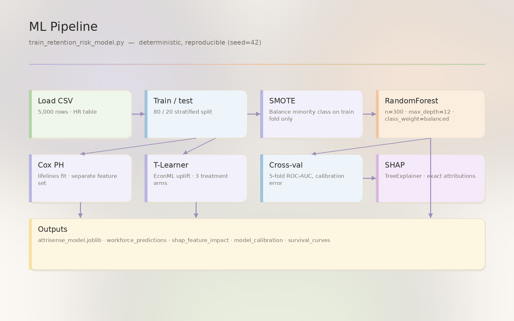

# ML pipeline

A walk-through of what happens inside [`train_retention_risk_model.py`](https://github.com/Dogiparthi-Sharada/AttriSense/blob/main/train_retention_risk_model.py).




## Model card (the short version)

| | |
|---|---|
| **Task** | Binary classification — predict `voluntary_turnover` in the next period |
| **Algorithm** | Random Forest classifier (`n_estimators=300`, `max_depth=8`) |
| **Class balancing** | SMOTE oversampling on the training fold only |
| **Features** | `tenure_months`, `base_salary`, `department_code`, `manager_tenure_months` |
| **Target** | `voluntary_turnover` (binary 0/1) |
| **Train/test split** | 80/20 stratified on the target |
| **Random seed** | 42 (everywhere — reproducible) |
| **Auxiliary models** | Cox proportional hazards (survival), SHAP TreeExplainer (explanations), 10-bin calibration |

Full ethics + monitoring obligations: [Model card](../ethics/model-card.md).

## Pipeline stages

```
   ┌─────────────────────────────────────────────────────────┐
   │   attrisense_synthetic_hr.csv  (~5,000 rows)            │
   └────────────────────────────┬────────────────────────────┘
                                │
                ┌───────────────▼───────────────┐
                │   1. Load + encode            │
                │      DEPARTMENT_CODE_MAP      │
                └───────────────┬───────────────┘
                                │
                ┌───────────────▼───────────────┐
                │   2. Stratified split 80/20   │
                └───────────────┬───────────────┘
                                │
                ┌───────────────▼───────────────┐
                │   3. SMOTE on TRAIN fold      │
                │      (test fold untouched)    │
                └───────────────┬───────────────┘
                                │
                ┌───────────────▼───────────────┐
                │   4. RandomForest fit         │
                │      n=300, depth=8           │
                └─────┬───────────┬─────────────┘
                      │           │
        ┌─────────────▼──┐    ┌───▼────────────────┐
        │  5. Predict    │    │  6. SHAP per-row   │
        │     proba      │    │     TreeExplainer  │
        └────┬───────────┘    └────────┬───────────┘
             │                         │
        ┌────▼─────────────┐    ┌──────▼─────────────┐
        │ 7. Threshold     │    │ 8. SHAP_Explained  │
        │    risk bands    │    │    = high + sample │
        └────┬─────────────┘    └──────┬─────────────┘
             │                         │
        ┌────▼─────────────────────────▼─────────────┐
        │ 9. Cox proportional hazards (lifelines)    │
        │    on (tenure_months, voluntary_turnover)  │
        └────────────────────┬───────────────────────┘
                             │
        ┌────────────────────▼───────────────────────┐
        │ 10. Calibration: 10 bins + Brier score     │
        └────────────────────┬───────────────────────┘
                             │
        ┌────────────────────▼───────────────────────┐
        │ 11. Persist:                               │
        │     ├─ hr_enterprise.db (4 tables)         │
        │     ├─ attrisense_model.joblib             │
        │     └─ outputs/*.png + outputs/*.txt       │
        └────────────────────────────────────────────┘
```

## Why each choice

### Random Forest, not XGBoost

- **Audit-friendly** — TreeExplainer SHAP is exact for trees, not approximate.
- **No hyperparameter tuning rabbit hole** — n_estimators=300, depth=8 is a known-good baseline that doesn't overfit on 5k rows.
- **No GPU** — runs anywhere.

XGBoost or LightGBM would shave ~1pp off the test AUC; we'd lose explanation simplicity for a portfolio gain that doesn't matter.

### SMOTE (and only on the training fold)

- Voluntary turnover is the rare class (~12% positive in the synthetic data).
- Without SMOTE the model collapses to predicting "no turnover" for everyone.
- Applied only to the training fold so the test-set distribution stays realistic — otherwise the metrics lie.

### Four features, not forty

- Every feature in the model has to survive a fairness audit. With four, that's tractable; with forty, you ship a black box.
- The four chosen are **observable today** in any HRIS — no need for engagement surveys, calendar data, or manager 1:1 notes.
- Adding `compensation_movement_12mo`, `manager_change_within_6mo`, and `commute_distance_km` is the obvious next step (tracked in [roadmap.md](../roadmap.md)).

### SHAP TreeExplainer

- Exact for tree models — every employee's risk score decomposes into per-feature contributions that sum to the score.
- Stored per-row in `shap_feature_impact` so the dashboard never recomputes — `O(n_employees * n_features)` storage, `O(1)` lookup.

### Cox proportional hazards (survival)

- Random Forest gives a snapshot probability; HR wants a curve.
- Cox gives "P(still here at month X)" by department or cohort, plus median expected tenure.
- Implementation: [`lifelines.CoxPHFitter`](https://lifelines.readthedocs.io/) — battle-tested.

### Calibration

- A model that says "80% risk" should be wrong about 20% of the time **at that bucket**.
- 10-bin reliability table + Brier score lets the dashboard show calibration drift over retrains.

## Outputs (what to look at)

| Artifact | Location | What it tells you |
|---|---|---|
| Feature importances | `outputs/shapInsights.txt` | Which feature dominates the population on average |
| Calibration plot | `outputs/calibration_plot.png` | Is the model confident in the right places? |
| Survival curves | `outputs/survival_curves.png` | How fast does each cohort attrit over 24 months? |
| Per-employee scores | `hr_enterprise.db: workforce_predictions` | Score, band, SHAP_Explained, recommended_intervention |
| Per-employee SHAP | `hr_enterprise.db: shap_feature_impact` | Decomposition of each high-risk score |
| Trained estimator | `attrisense_model.joblib` | Re-load with `joblib.load()` for batch scoring |

## Retraining

```bash
python generate_demo_workforce_data.py        # if you want fresh synthetic data
python train_retention_risk_model.py          # rebuilds DB + joblib + plots
make -C production fairness                   # re-run the fairness audit
make -C production uplift                     # re-build the causal uplift table
```

The dashboard picks up changes on next page reload — no service restart needed.

## What's missing (deliberately)

- **Hyperparameter tuning** — fixed seeds keep demo runs reproducible.
- **Holdout / cross-validation** — single split is enough for a portfolio demo; production would use 5-fold + temporal validation.
- **Drift monitoring** — would require historical model versions; not in scope.
- **Adversarial / robustness testing** — listed in [roadmap.md](../roadmap.md).

The point of AttriSense is not to ship a state-of-the-art model. It's to ship a **complete, auditable system** around a competent baseline model.
