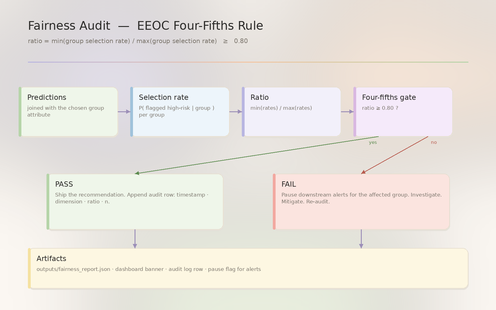

<!--
AttriSense — docs/ethics/fairness-policy.md
Author : Sharada Dogiparthi <dogiparthi.sharada@gmail.com>
Version: 1.0.0
Date   : 2026-05-07
License: MIT — see LICENSE in repo root.
Copyright (c) 2026 Sharada Dogiparthi. All rights reserved.
-->

# Fairness policy

> The policy AttriSense follows. The boundary it sets. The audit it runs.




## Position

A retention model that is more accurate for one group than another is a **harm distributor**, not a tool. AttriSense's policy is:

1. **Audit before action** — every dashboard view that could trigger an HR decision shows the disparate-impact ratio first.
2. **Pause-on-failure** — if any group fails the four-fifths rule, downstream alerts to managers should be paused for that group until the model is retrained.
3. **No fairness-through-unawareness** — removing protected attributes from the feature set is not a defence. Audit on the protected attribute even if the model didn't see it.
4. **Transparent over precise** — a slightly less accurate model with stable, auditable behaviour beats a state-of-the-art model whose group performance you can't characterise.

## What we audit

| Dimension | Currently audited | How |
|---|---|---|
| Department | ✅ | Dashboard tab + `outputs/fairness_report.json` |
| Manager | (extensible) | `run_audit(df, dimension="manager_id")` |
| Tenure band | (extensible) | derive a band column, then `run_audit(...)` |
| Gender | ❌ in synthetic data | Available in real HRIS — see "Real deployment" below |
| Age band | ❌ in synthetic data | Same |
| Ethnicity | ❌ in synthetic data | Same |

## The metrics we report

For each group:

| Metric | Definition | Threshold |
|---|---|---|
| **Selection rate** | P(model flags as high-risk \| group) | n/a — descriptive |
| **Disparate-impact ratio** | min_group_selection / max_group_selection | **≥ 0.80** ([EEOC four-fifths rule](https://www.eeoc.gov/laws/guidance/questions-and-answers-clarify-and-provide-common-interpretation-uniform-guidelines)) |
| **Positive rate** | P(label=1 \| group) | n/a — descriptive |
| **Calibration error** | mean(\|predicted_prob − actual_rate\|) per bin | ≤ 0.05 (informal) |
| **Sample size** | n per group | ≥ 30 to report (avoid small-sample noise) |

## When the audit fails

The dashboard banner turns red and the recommendation block shows:

1. **Pause** any downstream automated action on the affected group.
2. **Investigate** — is the disparity in the data, the labelling, or the model?
3. **Mitigate**:
   - Reweight training samples (SMOTE per group).
   - Apply a fairness constraint (Fairlearn `DemographicParity` / `EqualizedOdds`).
   - Drop the offending feature — only as a last resort.
   - Use a different model class.
4. **Re-audit** — the four-fifths rule must pass before lifting the pause.
5. **Document** the entire cycle: who decided, what changed, when re-audit ran, what the new ratio was.

## Why we don't auto-mitigate

Tempting to put a `if fairness_failed: apply_constraint()` line in `train_retention_risk_model.py`. We don't, because:

- Fairness mitigation is a **human decision**, not a build-time toggle. Different stakeholders weigh group-level fairness differently (selection rate vs. error rate vs. calibration).
- Auto-mitigation creates the illusion of fairness without engaging the conversation that should accompany it.
- Some mitigations harm the disadvantaged group on a different axis (e.g., demographic parity can hurt calibration).

The audit **surfaces the question**. The team **decides the answer**.

## NYC LL144 readiness

[NYC Local Law 144](https://www.nyc.gov/site/dca/about/automated-employment-decision-tools.page) requires automated employment-decision tools to undergo annual independent bias audits before deployment in covered uses.

AttriSense's built-in audit is **not** an LL144-compliant audit. It is the **input** to one. To be LL144-compliant, the audit must:

- Be conducted by an **independent third party**.
- Cover **race, ethnicity, and sex** at minimum.
- Cover **intersectional categories** where sample size permits.
- Be **published** in summary form on the deployer's website.
- Be **renewed annually** or after any material model change.

The output of `make fairness` (`outputs/fairness_report.json`) is the technical artifact a third-party auditor would consume.

## Real deployment

To audit real protected attributes:

1. Import them from the HRIS into a **separate** table (e.g., `employee_demographics`) — never into `workforce_predictions`.
2. Join at audit time only:

   ```python
   joined = predictions.merge(demographics, on="employee_id")
   report = run_audit(joined, dimension="gender")
   ```

3. Drop the demographics table from memory after the audit completes.
4. Log the audit run in the audit table — who ran it, when, what the result was.

The model itself never sees the protected attributes — it sees only `tenure`, `salary`, `department`, `manager_tenure`. This is "fairness through unawareness" at training time, plus active auditing at scoring time.

## Appeal process

Any employee flagged by the model has the right to:

- **See the score** (or its risk band).
- **See the SHAP drivers** (the dashboard provides these).
- **Contest** the score with a human reviewer.
- **Have the score deferred** until the contest is resolved.

A real deployment should expose a "Contest score" button next to each individual SHAP card. Currently this is a [roadmap](../roadmap.md) item.

## Is `employee_id` a source of bias? {#employee-id-bias}

**Short answer: No. The model never sees it.**

A reader looking at the `workforce_predictions` table sees an `employee_id` column and reasonably asks: *"Doesn't the ID number itself become a feature? Couldn't the model learn that 'IDs starting with 9 are more likely to leave' or some equally absurd shortcut?"*

It can't, because the model is never trained on `employee_id`. The training feature set is hard-coded in [`train_retention_risk_model.py`](https://github.com/Dogiparthi-Sharada/AttriSense/blob/main/train_retention_risk_model.py):

```python
FEATURE_COLUMNS = [
    "Tenure_Months",
    "Base_Salary",
    "Dept_Code",
    "Manager_Tenure_Months",
]

SURVIVAL_FEATURE_COLUMNS = [
    "Base_Salary",
    "Dept_Code",
    "Manager_Tenure_Months",
]
```

`employee_id` is **not** in either list. It exists in the predictions table for exactly two reasons:

1. **Joining** — to link a row in `workforce_predictions` back to the row in `employees`, `engagement_pulse`, or `exit_interviews`.
2. **Display** — so the dashboard can show "Employee 4827's drivers were …".

When you query the trained model:

```python
X = df[FEATURE_COLUMNS]      # 4 numeric columns only
proba = model.predict_proba(X)[:, 1]
```

There is no path by which the ID influences the prediction. SHAP explanations are computed on the same 4 features, so the ID also can't sneak into explanations.

### What about ID-derived bias (e.g., chronological hiring patterns)?

A theoretical concern: if IDs are issued sequentially and tenure correlates with ID, you might worry that "low ID = older employee = different risk profile." This is true, but the **model already gets `Tenure_Months` directly**. The ID adds no information beyond tenure, and excluding it removes a redundant signal — not a useful one.

### What we'd guard against in real data

| Risk | Mitigation |
|---|---|
| ID encodes department prefix (e.g., `ENG-1234`) | Strip prefixes before any feature engineering |
| Manager IDs leak into a feature column | Audit the feature list at training time (we do — see `FEATURE_COLUMNS`) |
| Demographic data joined on ID at training time | Keep demographics in a **separate** table, used only at audit time (see [Real deployment](#real-deployment)) |

### How to verify yourself

```bash
python -c "
from train_retention_risk_model import FEATURE_COLUMNS, SURVIVAL_FEATURE_COLUMNS
print('classifier features:', FEATURE_COLUMNS)
print('survival features  :', SURVIVAL_FEATURE_COLUMNS)
assert 'employee_id' not in FEATURE_COLUMNS + SURVIVAL_FEATURE_COLUMNS
print('OK: employee_id is not a model feature')
"
```

This is the kind of provenance check we'd add to CI in a real deployment.

### But the *human reviewer* can still introduce bias via the ID

The model can't see `employee_id`, but the **person reviewing the dashboard** can. If the reviewer recognises `EMP_2417` as "Ravi from the manufacturing floor," every subsequent decision is contaminated by what they already think about Ravi — performance, demographics, last week's argument.

This is **identification bias** (sometimes called *anchoring bias* in HR research). It's a real harm even when the underlying model is perfectly fair.

#### Mitigation: pseudonymized review IDs via a mapping table

The pattern AttriSense recommends for real deployments:

```
┌──────────────────────────┐         ┌──────────────────────────────┐
│  employees               │         │  review_id_map  (private)    │
│  ────────────            │  1:1    │  ──────────────────          │
│  employee_id  (real)     │◄───────►│  employee_id  (real)         │
│  name, email, manager…   │         │  review_id    (e.g. R-9F2A)  │
└──────────────────────────┘         │  rotated_at                  │
                                      └──────────────────────────────┘
                                                   │
                                                   ▼
                              ┌────────────────────────────────────┐
                              │  workforce_predictions             │
                              │  ──────────────────────            │
                              │  review_id  (only this leaves DB)  │
                              │  risk_score, drivers, …            │
                              └────────────────────────────────────┘
```

Properties:

1. **`review_id` is opaque** — a random token (e.g., `R-9F2A`, `R-7C18`), not derivable from name, email, or hire date.
2. **The mapping table is access-controlled** — only the HR partner who needs to act on a flag can look up the real employee. Reviewers (managers, executives, model owners) see only `review_id`.
3. **Rotation** — review IDs rotate on a schedule (e.g., quarterly), so a reviewer can't memorise the mapping over time.
4. **Audit log** — every reverse-lookup is logged: *who* mapped *which review_id* to *which employee*, *when*, and *why*.
5. **Demographic data is in a third table**, joined only at audit time, never to a review session.

#### Why this isn't built in today

The current AttriSense scaffold is a **demo on synthetic data** — there are no real names to protect, so we surface `employee_id` directly to make the dashboard easier to follow. For a real HRIS deployment we would:

- Add a `review_id_map` table populated by a one-way operation at ingest.
- Replace every `employee_id` in `workforce_predictions`, `shap_feature_impact`, and the dashboard with `review_id`.
- Gate reverse-lookups behind an "I need to act on this flag" button that writes an audit row.
- Add a CI check that no `name`, `email`, or `manager_name` column exists in any table the dashboard queries.

This is on the [roadmap](../roadmap.md) under **identification-bias controls**.

#### Quick win you can do today

Even without a full mapping table, you can blunt identification bias by **redacting names from the dashboard view** and surfacing only the random-looking `employee_id`. The current `EMP_2417` format is already partially opaque — but in real data, IDs often *do* leak hire-date order or department. A genuinely random token like `R-9F2A` removes that side channel too.

## Updated

May 7, 2026.
