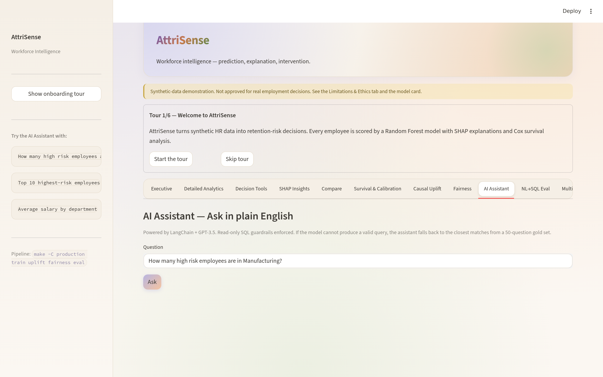

<!--
AttriSense — docs/features/ai-assistant.md
Author : Sharada Dogiparthi <dogiparthi.sharada@gmail.com>
Version: 1.0.0
Date   : 2026-05-07
License: MIT — see LICENSE in repo root.
Copyright (c) 2026 Sharada Dogiparthi. All rights reserved.
-->

# AI Assistant

> Natural language → SQL → table. Powered by LangChain + OpenAI when configured; gracefully falls back to a TF-IDF gold-question ranker when not.



## What you see

- **Question box** — type any question about the workforce data.
- **Generated SQL** — the LLM-generated query is shown verbatim.
- **Result table** — the query result.
- **Fallback suggestions** — when the LLM is unavailable or the generated SQL is invalid, three TF-IDF-ranked gold questions are suggested.

## What it answers

Anything that can be expressed as a `SELECT` over `workforce_predictions`. Examples:

- "How many high-risk employees are in Manufacturing?"
- "Top 10 highest-risk employees"
- "Average salary by department"
- "What is the median tenure of employees flagged as high risk?"
- "Show me all employees whose recommended intervention is manager_change"

## Code path

```
production/streamlit_app.py
  └── _ai_assistant_tab(df)
       ├── if OPENAI_API_KEY:
       │    └── natural_language_sql.run_nl_to_sql(query)   ← LangChain chain
       └── on failure / unparseable:
            └── nl_sql_fallback.suggest(query, top_k=3)     ← TF-IDF ranker
```

## Guardrails

| Guard | Where |
|---|---|
| Only `SELECT` and `WITH` allowed | [`natural_language_sql.py`](https://github.com/Dogiparthi-Sharada/AttriSense/blob/main/natural_language_sql.py) — regex validator |
| No `UPDATE` / `DELETE` / `DROP` / `INSERT` | Same |
| SQLite opened with `PRAGMA query_only=ON` | [`nl_sql_eval.py`](https://github.com/Dogiparthi-Sharada/AttriSense/blob/main/production/src/attrisense/nl_sql_eval.py) connection factory |
| Missing `OPENAI_API_KEY` → clear UX message | Tab handler |
| LLM connection failure → fallback to TF-IDF | Tab handler |

The validator is unit-tested by [`test_nl_sql_validator.py`](https://github.com/Dogiparthi-Sharada/AttriSense/blob/main/production/tests/test_nl_sql_validator.py).

## Fallback ranker (the offline path)

When OpenAI is unreachable (corp firewall, no key, rate limit), the AI Assistant uses [`nl_sql_fallback.py`](https://github.com/Dogiparthi-Sharada/AttriSense/blob/main/production/src/attrisense/nl_sql_fallback.py):

1. The 50 hand-validated [gold questions](../reference/nl-sql-gold-questions.md) are vectorised once with `TfidfVectorizer`.
2. The user query is vectorised the same way.
3. Cosine similarity ranks the gold questions.
4. Top 3 are shown as clickable suggestions.
5. Clicking one runs its **hand-validated** SQL — guaranteed to work, guaranteed not to mutate.

This is the difference between **"the AI is broken, sorry"** and **"the AI is offline, here are 3 questions you can run right now"**.

## Why this design beats a raw LangChain agent

A raw LangChain SQL agent would:

- Fail silently when the API is unreachable.
- Generate plausible-looking SQL that references non-existent columns.
- Have no test harness — every demo is a coin flip.

AttriSense's design:

- **Probes** the API before committing.
- **Validates** generated SQL against a regex allow-list before execution.
- **Falls back** to a deterministic ranker over gold questions.
- **Evaluates** the LLM regularly via [NL→SQL Eval](nl-sql-eval.md) — so you know if the model is degrading.

## Cost

- OpenAI `gpt-3.5-turbo` for SQL generation — ~$0.001 per question.
- Embedding model `text-embedding-3-small` for the multilingual RAG — ~$0.0001 per query.
- Fallback path is free + offline.

A team running 100 questions/day pays roughly $3/month for the AI features. A team running zero pays zero.
