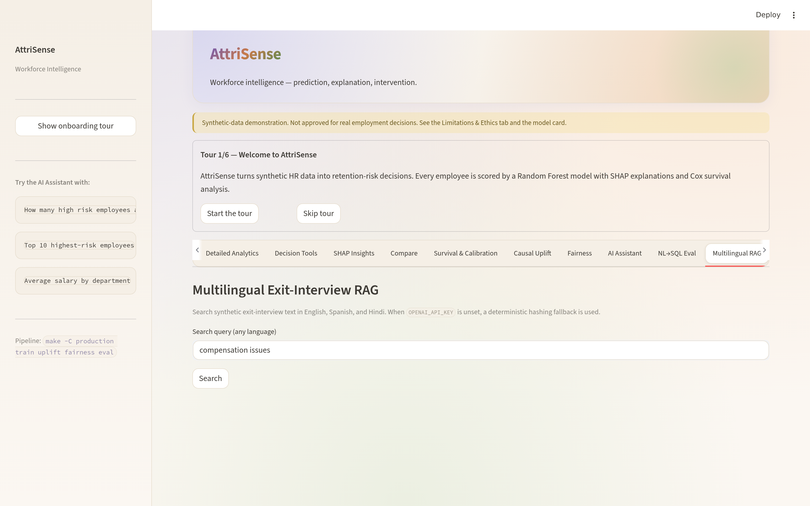
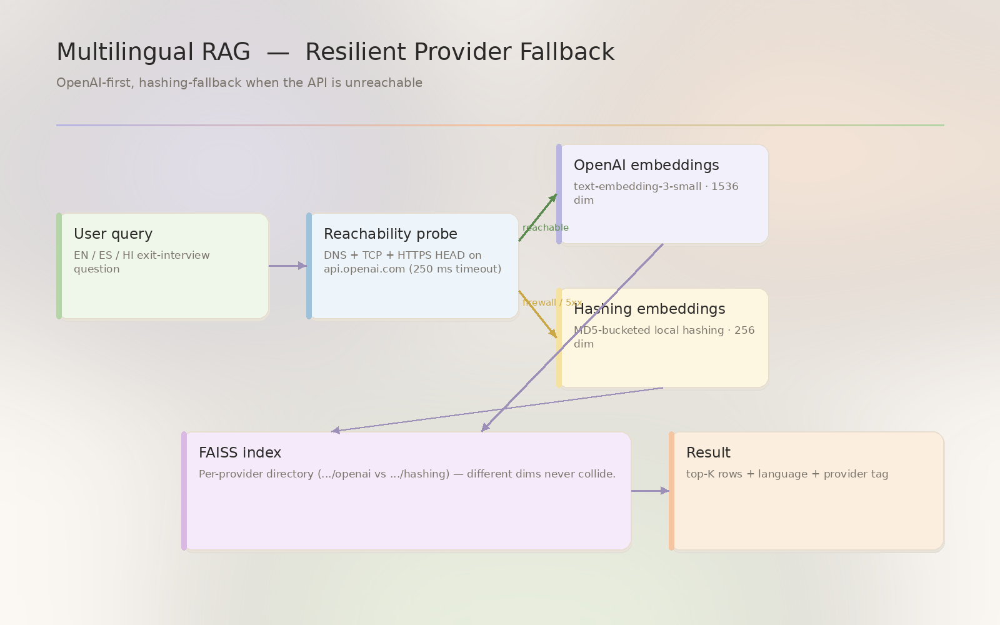

<!--
AttriSense — docs/features/multilingual-rag.md
Author : Sharada Dogiparthi <dogiparthi.sharada@gmail.com>
Version: 1.0.0
Date   : 2026-05-07
License: MIT — see LICENSE in repo root.
Copyright (c) 2026 Sharada Dogiparthi. All rights reserved.
-->

# Multilingual RAG

> Semantic search over synthetic exit-interview text in **English, Spanish, and Hindi**. A Spanish query can retrieve relevant English notes (and vice versa).





## What you see

- **Query box** — type a question in any language.
- **Results table** — top-K matches with text, language, theme, similarity score, and **provider** (`openai` or `hashing` so you can see which backend served the query).

## What it answers

| Question | Result |
|---|---|
| "compensation issues" (English) | Returns English, Spanish, *and* Hindi compensation notes |
| "problemas de compensación" (Spanish) | Same multilingual cluster |
| "manager priorities changing" | Retrieves the manager-priority cluster across all three languages |

## Code path

```
production/streamlit_app.py
  └── _multilingual_tab(df)
       └── multilingual_rag.search(query, top_k=6)
            ├── _build_embeddings()          ← OpenAI if reachable, else Hashing
            ├── _index_dir_for(provider)     ← per-provider FAISS dir
            ├── FAISS.load_local(...)
            └── store.similarity_search_with_score(...)
```

[`multilingual_rag.py`](https://github.com/Dogiparthi-Sharada/AttriSense/blob/main/production/src/attrisense/multilingual_rag.py) — 193 lines, tested by [`test_multilingual_rag.py`](https://github.com/Dogiparthi-Sharada/AttriSense/blob/main/production/tests/test_multilingual_rag.py).

## The fallback that fixed three tabs

Original implementation hard-failed on `openai.APIConnectionError` when the corp firewall blocked `api.openai.com`. The exception bubbled up through `main()`, killing not only Multilingual RAG but also Alert Mock and Ethics (the tabs after it in the same render call).

**The fix** ([commit-equivalent diff](https://github.com/Dogiparthi-Sharada/AttriSense/blob/main/production/src/attrisense/multilingual_rag.py)):

1. **Reachability probe** — `_try_openai_embeddings()` does a 5-second `embed_query("ping")` before committing to OpenAI.
2. **Per-provider index dirs** — `data/multilingual_index/{openai,hashing}/` so we never load a 1536-dim OpenAI index with the 256-dim hashing model.
3. **Mid-query fallback** — if OpenAI passes the probe but fails on the real query, the search retries with hashing.
4. **`HashingEmbeddings(Embeddings)`** — must inherit from `langchain_core.embeddings.Embeddings` or FAISS treats it as a callable function and crashes.

The dashboard now degrades gracefully on any of:

- No `OPENAI_API_KEY`
- Key set but firewall blocks the endpoint
- Key set, network OK, but rate-limited
- Key set, network OK, but mid-query timeout

## The hashing fallback

When OpenAI is unreachable, [`HashingEmbeddings`](https://github.com/Dogiparthi-Sharada/AttriSense/blob/main/production/src/attrisense/multilingual_rag.py) takes over:

- 256-dimensional vectors.
- Each character trigram contributes to a hashed slot.
- L2-normalised so cosine similarity behaves correctly.
- Deterministic, dependency-free, runs in microseconds.

Quality is **meaningfully worse** than `text-embedding-3-small` — trigram hashing has no semantic understanding, only surface-form overlap. But it lets the demo run anywhere, and cross-language queries still find rough matches because exit-interview themes share keywords (e.g., "manager", "compensation").

## The synthetic notes

12 notes, 4 themes × 3 languages, all in [`SYNTHETIC_NOTES`](https://github.com/Dogiparthi-Sharada/AttriSense/blob/main/production/src/attrisense/multilingual_rag.py):

| Theme | English | Spanish | Hindi (Romanised) |
|---|---|---|---|
| training | "I was not fully trained on the optical assembly workflow." | "No recibí suficiente capacitación en el flujo de ensamblaje óptico." | "Mujhe optical assembly workflow ke liye sahi training nahin mili thi." |
| shifts | "Manufacturing shifts are difficult to sustain over months." | "Los turnos de manufactura son difíciles de mantener durante meses." | "Manufacturing shifts long-term sustain karna mushkil ho gaya." |
| manager | "My manager kept changing priorities every week." | "Mi gerente cambiaba las prioridades cada semana." | "Manager har hafte priorities badal dete the." |
| compensation | "Compensation lagged the rest of the engineering market." | "La compensación estaba por debajo del resto del mercado de ingeniería." | "Compensation industry standards se kaafi peeche thi." |

A real deployment would point this at the actual exit-interview corpus.

## Why FAISS, not Pinecone

12 documents. A SaaS vector DB would be cargo-culting. FAISS runs in-process, persists to two files (`index.faiss` + `index.pkl`), and rebuilds in 0.2 seconds on the hashing backend.

## Index storage

```
data/multilingual_index/
├── openai/
│   ├── index.faiss
│   └── index.pkl
└── hashing/
    ├── index.faiss
    └── index.pkl
```

If you switch backends mid-session (e.g., the firewall lifts), the `data/multilingual_index/openai/` directory is built lazily on first OpenAI-backed query and kept around for next time.
