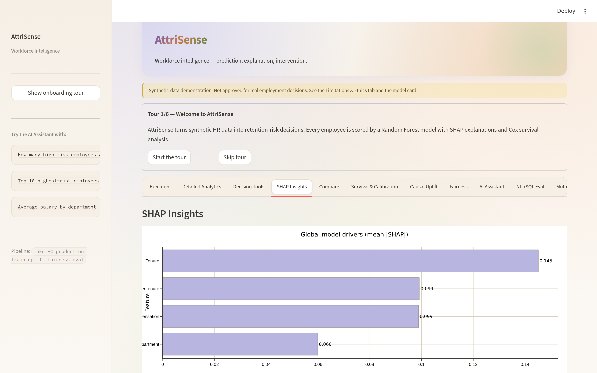

<!--
AttriSense — docs/features/shap-insights.md
Author : Sharada Dogiparthi <dogiparthi.sharada@gmail.com>
Version: 1.0.0
Date   : 2026-05-07
License: MIT — see LICENSE in repo root.
Copyright (c) 2026 Sharada Dogiparthi. All rights reserved.
-->

# SHAP Insights

> Per-employee feature attribution via SHAP TreeExplainer. The "why" behind every score.



## What you see

- **Population summary plot** — SHAP beeswarm aggregating contributions across employees.
- **High-risk employee picker** — dropdown of employees with `SHAP_Explained=1`.
- **Per-employee waterfall** — exact decomposition of the selected employee's risk score:
  - Base value (population mean prediction)
  - +/- contribution from each feature
  - Final risk probability
- **Feature impact table** — SHAP values numerically.

## What it answers

| Question | Where on the page |
|---|---|
| What drives turnover risk on average? | Beeswarm plot |
| Why is *this specific employee* flagged? | Waterfall chart |
| Which feature is the strongest negative force keeping someone? | Bottom of waterfall (negative SHAP values) |
| Are SHAP values stable across retrains? | Compare `shap_feature_impact` table across DB versions (in `outputs/`) |

## Code path

```
production/streamlit_app.py
  └── _shap_tab(df)
       ├── SQLite read: shap_feature_impact
       ├── shap.plots.waterfall          ← matplotlib (SHAP built-in)
       └── shap.plots.beeswarm           ← matplotlib (SHAP built-in)
```

The waterfall and beeswarm use SHAP's native matplotlib plots rather than a Plotly reimplementation. Reason: SHAP plots have specific conventions (left-to-right additive composition, zero baseline) that matter for interpretability, and SHAP's plots are recognisable to anyone who has read a SHAP paper.

## Why per-employee, not just global

Global feature importances ("salary matters most overall") are too coarse for HR action. The waterfall lets a manager say:

> "Alex is flagged because their tenure is short (+0.21), their salary is low for the department (+0.12), and their manager is new (+0.05) — so the recommended intervention is *manager change*, not a comp review."

That sentence is impossible from a global plot.

## SHAP_Explained = 1, not =1 for everyone {#shap_explained--1-not-1-for-everyone}

Storing SHAP values for all 5,000 employees would balloon the DB. Strategy:

- **All high-risk employees** → SHAP_Explained = 1 (always have explanations for the people who need action).
- **Risk-weighted random sample of low/medium** → SHAP_Explained = 1 (so the beeswarm is representative).
- **Everyone else** → SHAP_Explained = 0.

Tested by [`test_compare.py`](https://github.com/Dogiparthi-Sharada/AttriSense/blob/main/production/tests/test_compare.py) — the Compare panel uses `df[df["SHAP_Explained"].astype(bool)]` to select drivers safely.

## Known caveat

SHAP values are **explanations, not causes**. A feature with a high positive SHAP value contributed to the model's prediction; it is not necessarily the *cause* of turnover. For causal questions, see [Causal Uplift](causal-uplift.md).
