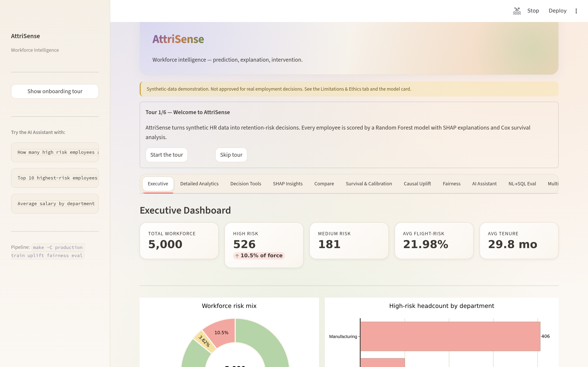

# AttriSense

> **Workforce intelligence for HR teams that want to retain people, not surveil them.**
>
> Predict who is at risk of leaving, **explain** *why*, simulate the **interventions** that move the needle, and audit the whole pipeline for **fairness** — all in one Streamlit dashboard backed by a small, auditable Python codebase.

  

---

## What is AttriSense?

AttriSense is a **production-shaped, explainable workforce-analytics system** built around three convictions:

1. **Prediction without explanation is dangerous.** Every high-risk score in AttriSense ships with SHAP feature attributions — the manager can see *why* the model flagged the employee.
2. **Correlation is not causation.** Standard ML scores tell you *who* will leave; the [Causal Uplift](features/causal-uplift.md) tab tells you *which intervention* (salary lift, manager change, tenure bonus) is most likely to actually retain that person.
3. **Fairness is a feature, not a footnote.** A built-in [Fairness Audit](features/fairness-audit.md) runs the EEOC four-fifths rule and surfaces disparate-impact failures before the model touches a real employment decision.

Built for an interview portfolio. Architected like something you would actually ship.

---

## At a glance

| | |
|---|---|
| **Stack** | Streamlit · scikit-learn · SHAP · EconML · LangChain · FAISS · SQLite · Plotly |
| **Lines of code** | ~4,400 (1,910 in `production/`, 2,443 in original demo) |
| **Tests** | 31 passing pytest tests |
| **Dashboard tabs** | 10 (Executive · SHAP · Compare · Causal Uplift · Fairness · AI Assistant · NL→SQL Eval · Multilingual RAG · Alert Mock · Ethics) |
| **Languages supported (RAG)** | English · Spanish · Hindi |
| **Data** | 100% synthetic, ~5,000 employees, safe to demo |
| **Deployment** | Local Python · Docker · GitHub Actions CI |

---

## Why this exists

HR analytics tools fall into two camps:

- **Vendor dashboards** (Workday, Visier, Eightfold) — closed-box scoring, opaque models, no story for *why* an employee is flagged.
- **Notebook prototypes** — great science, no UI, no fairness audit, no path to production.

AttriSense sits between them: a **small, transparent, fully-explainable** retention system that a non-technical HR partner can navigate, that an engineer can audit in a single sitting, and that an ethics reviewer can sign off on with documented checks.

If you're a recruiter or hiring manager skimming this, jump to [the live walkthrough](features/executive-dashboard.md) or the [60-second quickstart](quickstart.md).

---

## Choose your path

-   :material-rocket-launch: **Brand new — show me the dashboard**

    ---

    Five commands and you're looking at the live UI in your browser.

    [→ Quickstart](quickstart.md)

-   :material-sitemap: **Engineer — show me the architecture**

    ---

    Data flow, ML pipeline, dependency graph, why each library was chosen.

    [→ Architecture overview](architecture/overview.md)

-   :material-feature-search: **Reviewer — show me the features**

    ---

    One page per dashboard tab with screenshots and the underlying code.

    [→ Feature catalogue](features/executive-dashboard.md)

-   :material-scale-balance: **Ethics / Compliance — show me the policy**

    ---

    Model card, fairness policy, intended-use boundaries, NYC LL144 readiness.

    [→ Model card](ethics/model-card.md)

-   :material-cog-outline: **Ops — show me how to run it**

    ---

    Install, configure, run with Docker, set up CI, manage secrets.

    [→ Operations guide](operations/installation.md)

-   :material-help-circle: **Stuck — something is broken**

    ---

    Common errors, the firewall trap, csh quirks, KeyError fixes.

    [→ Troubleshooting](troubleshooting.md)

---

## The two dashboards

AttriSense ships **two independent Streamlit apps** that share the same data layer:

| | Original demo | Production dashboard |
|---|---|---|
| **Path** | [`streamlit_app.py`](https://github.com/Dogiparthi-Sharada/AttriSense/blob/main/streamlit_app.py) | [`production/streamlit_app.py`](https://github.com/Dogiparthi-Sharada/AttriSense/blob/main/production/streamlit_app.py) |
| **Launch** | `python launch_streamlit_app.py` | `make -C production run` |
| **Tabs** | Executive overview, SHAP, What-If, Survival, AI Assistant | All 10 tabs (adds Compare, Causal Uplift, Fairness, NL→SQL Eval, Multilingual RAG, Alert Mock) |
| **Theme** | Streamlit default | Dark SaaS palette ([theme.py](reference/api.md#theme)) |
| **Tests** | None | 31 passing |
| **Docker** | No | Yes (`production/Dockerfile`) |
| **Why both exist** | The original is the historic interview deliverable; preserved verbatim. The production layer is the production-shaped follow-up. |

Read [Why two apps?](design/decisions.md#why-two-apps) for the full reasoning.

---

## A note on data

**Every employee in this repo is synthetic.** The dataset is generated by [`generate_demo_workforce_data.py`](https://github.com/Dogiparthi-Sharada/AttriSense/blob/main/generate_demo_workforce_data.py) with a fixed `RANDOM_SEED=42`.

This is deliberate:
- The repo is public — no real HR data should ever be here.
- Synthetic data lets us exercise the full fairness audit without privacy risk.
- The Manufacturing department is intentionally seeded with a stronger turnover signal so the [Fairness Audit](features/fairness-audit.md) has something real to flag (DI ratio = 0.20, fails the EEOC four-fifths rule — by design).

See [Intended Use](ethics/intended-use.md) for the boundaries of what this model is and is not for.
